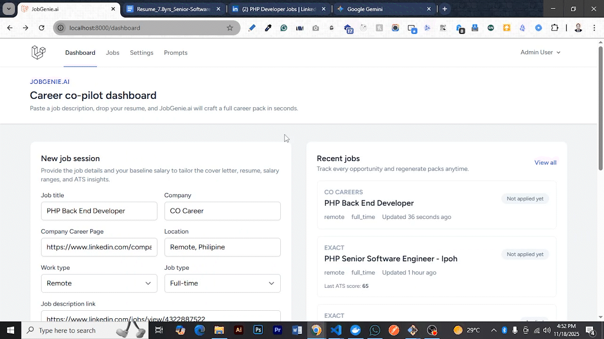

#  JobGenie.ai

## Your AI-Powered Career Co-Pilot — Apply Smarter, Interview Stronger, Get Hired Faster.

JobGenie.ai is an AI-powered SaaS platform that transforms the job search into a fast, guided, and confidence-boosting experience.

It works like a personal career coach — available 24/7.

Whether you're a job seeker wanting an edge or an employer needing better insights, JobGenie helps you win the hiring process.

<p align="center">
  <a href="#demo">Demo</a> •
  <a href="#features">Features</a> •
  <a href="#tech-stack">Tech Stack</a> •
  <a href="#testing">Testing</a> •
  <a href="#system-design">System Design</a> •
  <a href="#why-it-stands-out">Why it Stands Out</a> •
  <a href="#notes">Notes</a> •
  <a href="#pricing">Pricing</a> •
  <a href="#license">License</a> •
  <a href="#contribute">Contribute</a> •
  <a href="#revenue">Revenue Model</a> •
  <a href="#credit">Credit</a>
</p>

---

## <a id="demo"></a>🎬 Demo



Paste a job description, your resume, and your baseline salary — JobGenie instantly generates:

-   🎯 Tailored cover letters

-   📄 Resume rewrites & improvement suggestions

-   📊 ATS optimization insights

-   💰 Salary guidance based on industry/location

-   🎤 Interview prep with Q&A

-   🤝 Recruiter & negotiation scripts

-   🔁 Follow-up messages

-   📚 A full career “prep pack”

---

## <a id="tech-stack"></a>🚀 Features

## <a id="features"></a>🚀 Features

### 1. Core AI Career Pack

For every job session, JobGenie generates:

-   🎯 **Tailored cover letters** aligned with the JD and your profile
-   📄 **Resume rewrites & improvement suggestions** to match required skills
-   📊 **ATS optimization insights** and an **ATS score** for that role
-   💰 **Salary guidance** in your native currency + USD (monthly and yearly)
-   🧮 **Salary baselines** based on:
    -   Market range
    -   Company’s country & job type (remote / hybrid / onsite, full-time / part-time / contract)
    -   Your skills and experience for that role

### 2. Smart Memory & Autofill

JobGenie remembers your key inputs so you don’t start from scratch every time:

-   ✅ Stores **resume text**, **native currency**, and **recent salary** in your profile
-   ✅ Saves **baseline salary**, **job title**, and **company info** per job
-   ✅ When you start a new job session:
    -   Your **last used resume**, **baseline salary**, and **currency** are **auto-filled**
    -   You can **edit or override** them anytime
-   ✅ Each job retains its own history: cover letters, resumes, ATS scores, salary ranges, and notes

This makes rapid-fire applications and iteration across many roles much faster.

### 3. Job Tracking & Interview Workflow

Turn chaotic job hunting into a clean pipeline:

-   🗂️ **Job tracking dashboard**

    -   Statuses like `Not applied`, `Applied`, `Interview scheduled`, `Offer received`, `Rejected`, etc.
    -   View all sessions, ATS scores, and salary insights per job

-   🔁 **Revisit any job**

    -   Regenerate or tweak cover letters & resumes
    -   Update baseline or target salary
    -   Re-apply or follow up when opportunities reopen

-   📅 **Interview & offer stages**
    -   Update status: `Call for interview`, `Offer letter received`, `Rejected`, etc.
    -   Each status unlocks **contextual helpers**:
        -   “Prepare for interview” prompts
        -   Negotiation helpers using your **email/chat transcripts**
        -   Follow-up templates & cadence suggestions

### 4. Conversation Helpers (Per Job)

Every job has its own AI “thread”:

-   🎤 **Interview prep**

    -   Role-specific Q&A
    -   Technical + behavioral questions
    -   Suggested STAR-style answers

-   🤝 **Negotiation helper**

    -   Paste recruiter emails or chat snippets
    -   Get response drafts that balance confidence and politeness
    -   Suggestions on when to push and when to compromise

-   🔁 **Follow-up assistant**
    -   Follow-up messages after interviews, ghosting, or rejections
    -   Re-approach templates when roles reopen
    -   Company revisit notes (website, careers page, application history)

All conversations are stored **per job**, so context is never lost.

### 5. Prompt Management & Experimentation

Built for people who love tuning prompts:

-   🧩 **Prompt management table**

    -   Single `prompts` table for all flows (career pack, ATS, interview, negotiation, follow-up, etc.)
    -   Fields: `slug`, `scope`, `role`, `version`, `is_active`, `content`, `description`, timestamps

-   🧪 **Clone & versioning**

    -   “Clone version” action in the UI
    -   New version gets `version + 1` and becomes active
    -   Older versions remain in history (can be re-activated)

-   🛠️ **Live editing**
    -   Edit system/user prompts from the web UI
    -   No redeploy needed
    -   Cache is flushed when prompts change so new runs use the latest copy

This makes JobGenie a powerful playground for **prompt engineering for careers**.

### 6. LLM & Configuration Layer

-   🔌 **LLM-agnostic architecture**

    -   Pluggable `LlmServiceInterface`
    -   Gemini is wired in by default, but you can add other providers

-   🔑 **Config hierarchy**
    -   Primary keys and models loaded from `.env`
    -   Admin UI allows:
        -   Overriding provider/model
        -   Securely storing encrypted API keys in DB
    -   UI overrides take precedence over `.env` but you can always fall back

### 7. Developer & SaaS Foundations

-   🗄️ **Persistent job sessions**
    -   PostgreSQL-backed storage for jobs, sessions, conversations, prompts, and configs
-   🧵 **Queues**
    -   Database or Redis queue support for background generation
-   🐳 **Dockerized dev stack**
    -   PHP-FPM + Nginx + PostgreSQL for local development
-   👥 **User accounts**
    -   Authenticated, per-user job history & preferences
-   💼 **SaaS-ready design**
    -   Clear separation of `users`, `jobs`, `job_sessions`, `job_conversations`, `prompts`, `app_configs`

JobGenie.ai is designed to serve **individual job seekers** today, and scale into **teams, agencies, and platforms** tomorrow.

---

## <a id="tech-stack"></a>🧰 Tech Stack

| Area                 | Technologies Used                                                            |
| -------------------- | ---------------------------------------------------------------------------- |
| **Backend**          | Laravel 12, PHP 8.2, Service layer, Repositories                             |
| **Frontend**         | Blade, TailwindCSS, Alpine.js, Vite                                          |
| **AI / LLM**         | Google Gemini LLM integration, Pluggable service layer `LlmServiceInterface` |
| **Database**         | PostgreSQL (primary), MySQL compatible, database queue driver.               |
| **Queues / Caching** | Redis or database queues                                                     |
| **Auth**             | Laravel Breeze-style auth (session-based, Blade + Tailwind + Alpine)         |
| **Config Mgmt**      | `.env` + `app_configs` table for runtime overrides                           |
| **Prompt Mgmt**      | `prompts` table, `PromptService`, admin UI                                   |
| **Deployment**       | Native PHP / Nginx, optional Docker setup                                    |
| **Build Tools**      | Composer, NPM, Vite                                                          |
| **Payment**          | Stripe Checkout + Billing webhooks                                           |

---

## Docker workflow

The repository ships with a production-ready Dockerfile and a local docker-compose stack.

### Build & boot

```bash
docker-compose up --build -d
# first-time setup
docker-compose exec app php artisan migrate --seed
```

-   App: http://localhost:8080
-   Postgres: exposed on `localhost:5432`

The `app` service mounts the current workspace, so local file changes are reflected immediately. Run artisan commands via `docker-compose exec app php artisan <command>` and start Vite with `docker-compose exec app npm run dev`.

---

## Local Development

### 1. Clone & install dependencies

```bash
cp .env.example .env
composer install
npm install
php artisan key:generate
```

### 2. Configure environment

-   Update `.env` with your PostgreSQL credentials (defaults assume Docker Compose service names).
-   Set `LLM_PROVIDER`, `LLM_MODEL_NAME`, and leave `GEMINI_API_KEY` blank until ready to supply a key.

### 3. Database & seeds

```bash
php artisan migrate --seed
```

This seeds the default prompt library and creates a sample admin user (`admin@example.com` / `password`).

### 4. Run the dev stack

```bash
php artisan serve
npm run dev
```

Visit http://127.0.0.1:8000 to log in.

---

## LLM configuration

-   `.env` provides baseline values: `LLM_PROVIDER=gemini`, `LLM_MODEL_NAME=gemini-1.5-pro`, and `GEMINI_API_KEY`.
-   Admins can override provider/model/API key in **Settings → AI Configuration**. Override keys are encrypted in the `app_configs` table and take precedence over `.env`.
-   The Gemini integration expects JSON responses for career packs; failures are logged and surfaced in the UI.

---

## Prompt Management

Admins (users with `is_admin = true`) can edit prompts in **Admin → Prompts**:

-   Clone a prompt to increment the version and automatically activate the new record.
-   Toggle active/inactive states without deleting history.
-   Editing or cloning a prompt automatically flushes the prompt cache so the new content is used immediately.

Default prompts seeded include:

-   Career pack system/user
-   Interview prep system/user
-   Negotiation helper system/user
-   Follow-up helper system/user

---

## Testing & queues

-   Queue driver defaults to `database` with a dedicated `queue_jobs` table (`config/queue.php` updated). Run `php artisan queue:work` to process background jobs when you introduce them.
-   PHPUnit configuration ships with Laravel defaults; add feature/unit tests as needed.

---

## Credentials

After seeding, log in with:

-   Email: `admin@example.com`
-   Password: `password`

Update the profile to include your resume text and native currency for the best results.

## 💬 Why JobGenie.ai?

Job searching is stressful, slow, and often lonely.  
JobGenie.ai turns it into a **guided**, **data-backed**, and **AI-assisted** experience.

If you want:

-   Better applications
-   Faster iterations
-   Smarter interviews
-   Stronger negotiation & follow-ups

…then JobGenie.ai is built for you.

---

## <a id="why-it-stands-out"></a>🛡️ Why JobGenie.ai Stands Out

-   ⚙️ **Built for real job search workflows**  
    Not just a playground for prompts—every feature is aligned with a real pipeline: JD → application → interviews → offer or rejection → re-approach.

-   🧠 **Prompt-centric & UI-tunable**  
    Prompts are first-class citizens in the database and UI, making it easy to experiment without redeploying.

-   🔌 **LLM-agnostic core**  
    Start with Gemini, plug in any other LLM later with a single service interface.

-   🗂️ **Job-aware memory**  
    Every job keeps its own history: sessions, conversations, ATS insights, salary context.

-   🚀 **SaaS-ready design**  
    Clean separation of users, jobs, prompts, configs — ready for subscriptions, teams, and usage-based billing.

---

## <a id="notes"></a>🧠 Development Notes (WIP)

-   Planned features and improvements:
    SMTP failure told app to setup smtp through web interface
    if api key is missing, app to show message to setup through web interface
    Is it possible to rewrite those parts in .env file through web interface?
    If there is no subscription plan, app to show message to setup through web interface
    there is no landing page for jobgenie, need registration with google , login with google is needed
    
-   🚧 Adding richer analytics for:
    -   Per-job success probability signals
    -   Which prompts lead to higher ATS scores
-   🔜 Multi-tenant mode for teams and agencies
-   📊 Advanced ATS insights grouped by:
    -   Skills, responsibilities, culture fit, and seniority level
-   📤 Export options:
    -   PDF / DOCX career packs
    -   Email-ready templates

---

## <a id="pricing"></a>dY', Pricing (Concept)

| Plan               | Mode     | Ideal For              | Highlights                                                                |
| ------------------ | -------- | ---------------------- | ------------------------------------------------------------------------- |
| **JobSeeker Free** | Prepaid  | Individual job seekers | 20k prepaid AI tokens with a hard stop, billing portal, invoice archive   |
| **Pro**            | Postpaid | Power users            | 200k included tokens + overage metering, Gemini/OpenAI ready              |
| **Team**           | Postpaid | Agencies / bootcamps   | Shared workspaces, pooled token reporting, centralized invoices           |
| **Token Starter**  | Prepaid  | Token bundle buyers    | Purchase fixed token packs per month with low/out-of-token alerts         |
| **Enterprise**     | Hybrid   | Platforms / HR tools   | API access, SSO, custom LLM routing, Stripe-based billing hooks, white-label |

> The open-source foundation focuses on the engine and flows; SaaS pricing is adaptable per market.

### Billing & Subscriptions

-   Full subscription domain model (plans, subscriptions, invoices, AI usage records) backed by PostgreSQL migrations.
-   Stripe Checkout integration (hosted redirect + Elements fallback) with Laravel services for account, subscription, and invoice syncing.
-   Customer billing portal (`/billing`) showing active plan, prepaid/postpaid labels, remaining tokens, invoices, and one-click upgrades.
-   Admin billing console for managing plans, AI pricing overrides, and invoice monitoring.
-   AI metering that records input/output tokens, costs per provider/model, prepaid token enforcement, and low/out-of-token notifications.
-   Monthly invoice generator (`php artisan billing:generate-monthly-invoices`) that combines subscription fees + AI usage and emails customers.

---

## <a id="license"></a>📜 License

JobGenie.ai is currently structured as a **portfolio / starter SaaS project**.

When taking it public, you can choose a license such as:

-   **MIT** – for maximal open-source adoption
-   **AGPL-3.0** – to ensure improvements to hosted versions are shared
-   **Commercial / dual-licensed** – for protecting proprietary SaaS offerings

Pick the license that best matches your goals for community vs. commercial use.

---

## <a id="contribute"></a>🤝 Contribute

Ideas and contributions are welcome, especially around:

-   Better prompt design for ATS and salary guidance
-   New interview patterns for specific roles (backend, data, PM, etc.)
-   Additional LLM integrations and evaluation tooling

You can fork, adapt, and extend JobGenie.ai into your own product or internal tool.

---

## <a id="revenue"></a>💰 Revenue Model (If Commercialized)

-   **Freemium SaaS**

    -   Free tier with limited packs and basic insights
    -   Paid tiers for volume, analytics, and more advanced workflows

-   **B2B integrations**

    -   Offer the engine to job boards, bootcamps, HR SaaS as a white-label component

-   **Enterprise customizations**
    -   Dedicated hosting, data residency, compliance, and deep ATS integrations

This creates a sustainable path while still enabling an open-source or hybrid core.

---

## <a id="credit"></a>👨‍💻 Built & Maintained By

👔 Actively exploring CTO-track, Staff/Principal Engineer, System Architect, and Engineering Leadership roles  
📨 Let’s connect for high-impact backend, AI, platform, or architecture-led positions

**Shaon Majumder**  
Senior Software Engineer / Engineering Manager → CTO-Track | AI & Scalability  
Open source contributor | Laravel ecosystem expert | System design & architecture advocate

-   Email: `smazoomder@gmail.com`
-   Portfolio: https://shaonresume.netlify.app
-   LinkedIn: https://linkedin.com/in/shaonmajumder
-   Medium: https://medium.com/@shaonmajumder
-   GitHub: https://github.com/ShaonMajumder

Specialized in scalable APIs, distributed systems, and AI integration (OpenAI, Gemini, MCP), with a track record of leading engineering teams and shipping high-impact platforms across healthcare, fintech, telecom, logistics, garments, and e-commerce.

---

## 🆕 What This Update Added

-   Added subscription plans, subscriptions, invoices, and AI usage tables/models with helper methods on `User`.
-   Integrated Stripe Checkout/Elements plus a Laravel StripePaymentService for accounts, subscriptions, and invoices.
-   Delivered a billing portal, admin plan & AI pricing UIs, and navigation links for both customers and admins.
-   Wrapped the LLM service with AI metering, prepaid enforcement middleware, low/out-of-token emails, and billing-aware controllers.
-   Built the `billing:generate-monthly-invoices` command, Stripe checkout success/cancel handlers, and billing-focused feature tests.
-   Updated configuration, docker, and README docs to cover prepaid vs postpaid plans, AI pricing, and the new SaaS billing flow.
